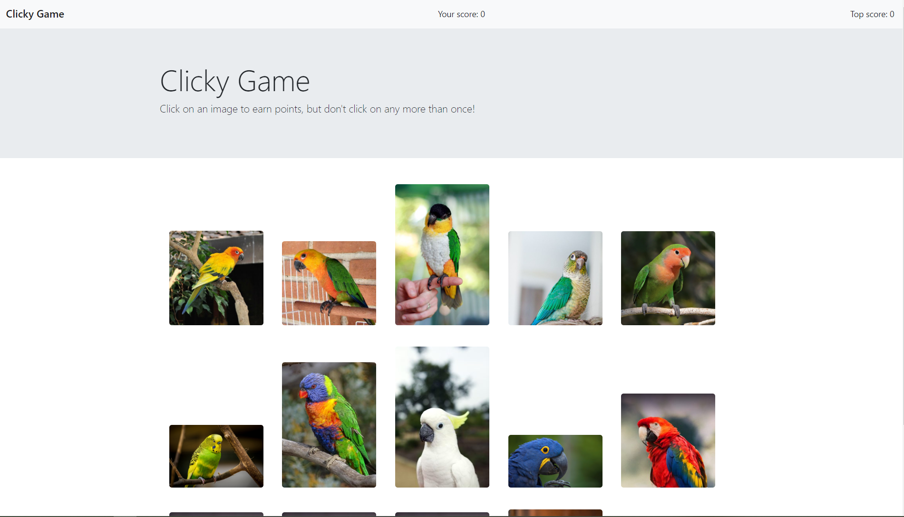

# Avian Memory Game

The Avian Memory Game is a ReactJS game for users to test their memory on which exotic bird they have clicked on! When a user clicks on one of the cards, it will shuffle the cards, and which the user will take continuous turns to win the game!

## How to Use

Just click on the deployed link and begin clicking on images you think you haven't clicked before!

## Deployed link

https://yutsukushi.github.io/Clicky-Game/

## Development

Most aspects coded by Yukie Kushibiki with tutoring assistance by Bala Nekkanti.